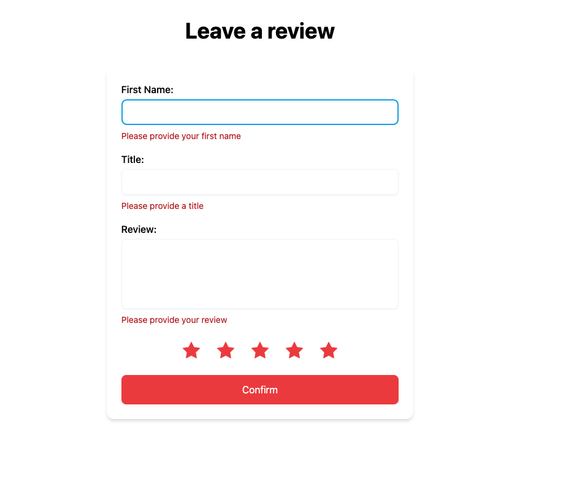

# Welcome to Testing Journey

## Intro

We'll try to simulate a real working environment as we go through the journey.

You're given a wireframe with a set of requirements.

## You are to build a review form

#### Requirements:

1. Allow a user to input their first name
2. Allow a user to input a review title
3. Allow a user to input a review
4. Allow a user to assign a rating 1-5

#### Restraints:

1. Ratings should default to a full 5 stars.
2. When a user hovers over a star rating, the ratings should reflect the selected rating.
   > e.g. a user hovers over star #3, the first 3 stars should be highlighted and the remaining 2 are empy.
3. All of the fields should be completed before a user is allowed to continue to the confirm page
4. A user should not be allowed to continue without completing the form, if they attempt to continue, they should see an error describing what they did wrong.

## Confirmation Page

After the user has completed the form and we've validated that all of the fields are complete..

The user should be taken to a confirmation page.

#### Requirements:

1. The user should be able to review their answers.
2. Each field on the form should be displayed on the confirmation page with it's answer below it.
3. Ratings should be displayed as a number instead of stars.
4. The submit button should send the users answers to the endpoint
   `/api/submit-review` as a `POST` request.
5. The user should be taken to the thank you page `/thanks` after their review has been submitted.

##### To continue run:

    git checkout unit-testing-01
