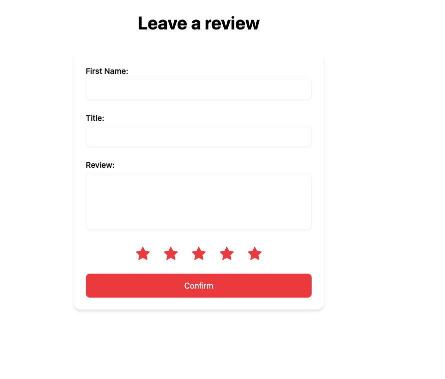
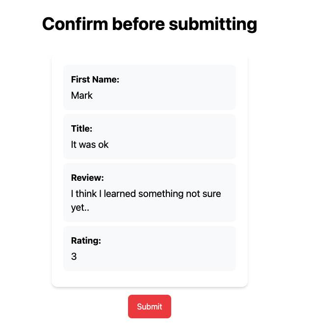

# 01-unit-testing

## What is unit testing?

- Small unit of code
- Independent of other pieces of code
- Asserting if the units behavior matches it’s expectation
- Isolated React Component
- Isolated function or logic

### RTL role in unit tests

- Isolated React Component
- Use RTL’s API to query the component’s structure

### Jest’s role in unit tests

- Provides the JSDOM environment

  - This is how we can render markup without a real browser

- Provides utilities for assertion

  - toBe
  - toEqual
  - Etc..

- We use testing-library/dom-library for even more helpers
  - toBeInTheDocument()
  - toHaveTextContent()
  - toHaveClass()
  - Etc..

## Tasks

1. Identify all of the unique elements throughout the review and confirmation pages
   - How many components can you break it up into?
   - How many can be shared?

### Component List

_Feel free to commit your answers_

1.
2.
3.

...

##### To continue run

    git checkout unit-testing-02

### More Learning Resources

[12 Recipes for testing React Applications with RTL](https://joaoforja.com/blog/recipes-for-testing-react-apps-tl/)

[Thought Process for testing a React Application](https://joaoforja.com/blog/how-to-write-tests-react-app-case-study/)

[5 things you didnt know about testing library](https://polvara.me/posts/five-things-you-didnt-know-about-testing-library)
